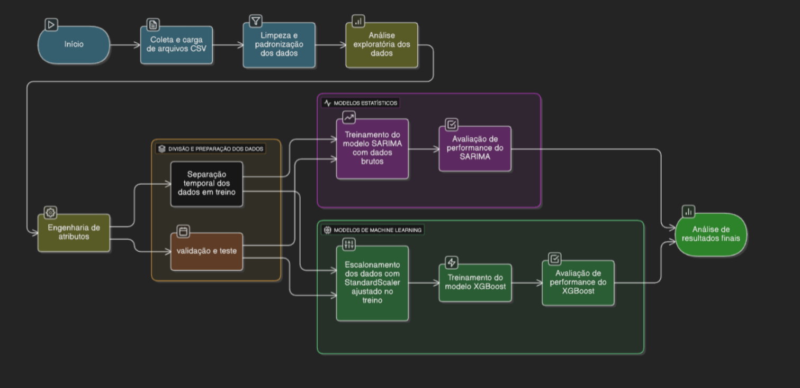

# Análise e Previsão da Taxa de Desocupação no Brasil: SARIMA vs XGBoost

> **Projeto Aplicado IV - Ciência de Dados**
> *Universidade Presbiteriana Mackenzie*

Este projeto compara a eficácia de modelos estatísticos clássicos (**SARIMA**) versus algoritmos de aprendizado de máquina (**XGBoost**) na previsão da taxa de desemprego no Brasil (2012-2025), utilizando dados macroeconômicos oficiais e indicadores de comportamento digital (*Google Trends*).

## 📺 Apresentação em Vídeo

Assista à explicação completa do projeto, metodologia e análise dos resultados no YouTube:

*(Clique na imagem acima para assistir)*

---

## 🎯 Objetivo
Avaliar se a inclusão de dados alternativos (volume de buscas no Google) e o uso de modelos não-lineares (XGBoost) superam a performance de modelos econométricos tradicionais em cenários de volatilidade econômica, como a pandemia de COVID-19.

## 🗂️ Estrutura do Repositório

* `Data/New/`: Contém as bases de dados brutas consolidadas (PNAD, BCB, Google Trends).
* `Notebooks/`: Código fonte completo em Jupyter Notebook com a análise exploratória, pré-processamento e modelagem.
* `Images/`: Diagramas e gráficos gerados durante o estudo para documentação.

## 📊 Metodologia e Solução

O pipeline de dados seguiu um fluxo rigoroso de ETL, Engenharia de Atributos e Modelagem Comparativa, conforme ilustrado no diagrama abaixo:

### Etapas Principais:
1. **Coleta:** Integração de dados do IBGE (PNAD Contínua), Banco Central e Google Trends.
2. **Análise Exploratória:** Validação da Lei de Okun (relação inversa entre PIB e Desemprego) e identificação de sazonalidade.
3. **Modelagem:**
   * **Trilha Estatística:** Modelo SARIMA com diferenciação sazonal ($d=1, D=1$).
   * **Trilha Machine Learning:** XGBoost otimizado via *Grid Search*, utilizando *lags* e dados exógenos.

## 📈 Resultados Principais

Contrariando a hipótese inicial de que o modelo mais complexo venceria, o modelo estatístico (SARIMA) apresentou maior robustez e menor erro no horizonte de teste.

| Modelo | RMSE | MAE | MAPE |
| :--- | :---: | :---: | :---: |
| **SARIMA** | **0.6514** | 0.5962 | **9.44%** |
| **XGBoost** | 0.6856 | **0.5931** | 9.86% |

**Comparação Visual:**
O gráfico abaixo mostra que o SARIMA (linha azul) projetou uma curva mais consistente com a sazonalidade histórica, enquanto o XGBoost (linha verde) teve dificuldades de extrapolação.

## 🛠️ Tecnologias
* **Python 3.11.4**
* Pandas, NumPy
* Statsmodels (SARIMA)
* XGBoost
* Scikit-learn
* Matplotlib, Seaborn

## 👥 Autores
* **Andre Gustavo Monteiro dos Santos**
* **Raul Santos Lages**

---
*Este projeto foi desenvolvido como requisito parcial para a conclusão do curso de Ciência de Dados.*
